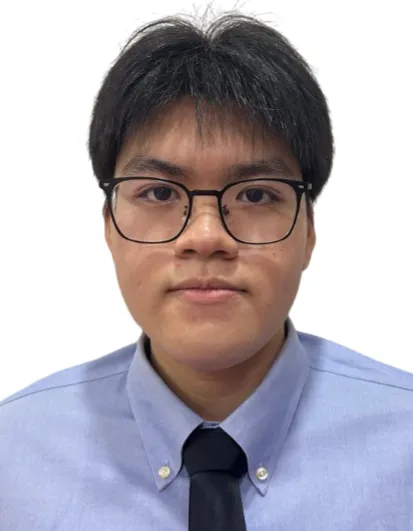
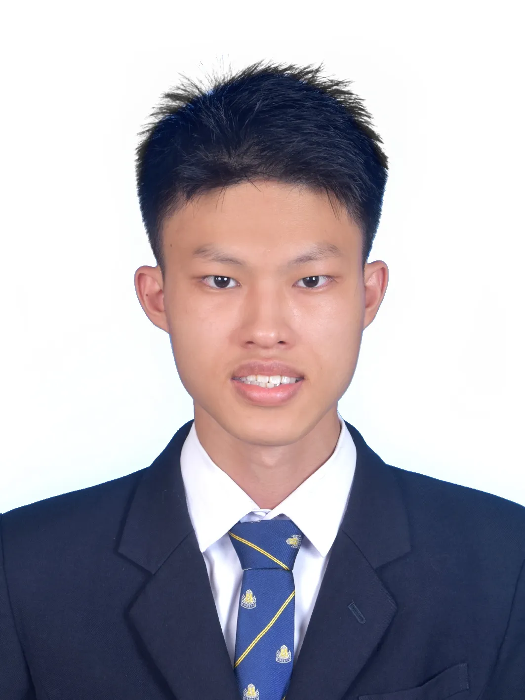
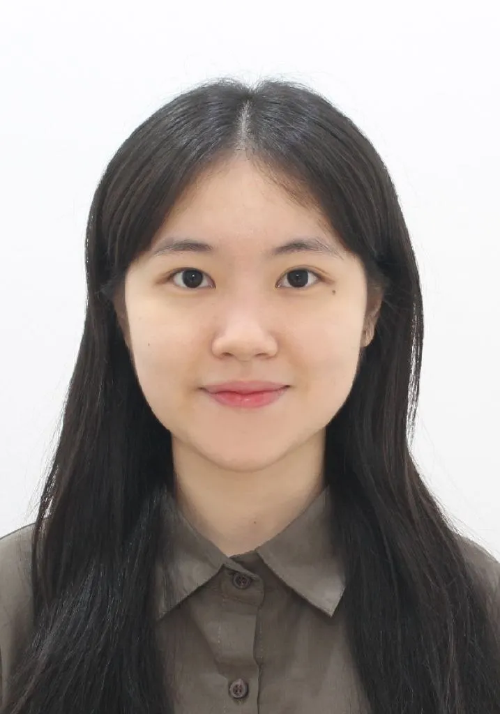
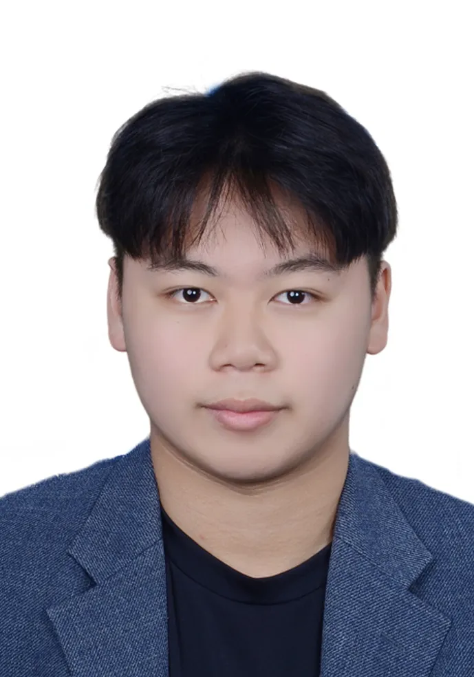

# Welcome to niubility 2.0! 🚀

``````

## About Our Group Name

**niubility 2.0** - Our name represents our commitment to excellence and innovation! "Niubility" is a playful term that combines strength and capability, while "2.0" signifies our modern approach and continuous improvement mindset. We chose this name because we believe in pushing boundaries and evolving our skills as we work on this HCI project together.

---

## Meet Our Team

### 👑 Group Leader: Edwin Tan Yee En



**Role:** Group Leader & Coordinator

Edwin leads our team with dedication and vision. As our group leader, he coordinates our efforts, ensures everyone stays on track, and helps facilitate effective communication among team members. His organizational skills and leadership qualities make him the perfect person to guide niubility 2.0 toward success.

---

### 👨‍💻 Lee Wei Xuan



**Role:** Developer & Technical Lead

Wei Xuan brings strong technical expertise to our team. With excellent problem-solving skills and a keen eye for detail, he contributes significantly to the technical aspects of our project. His ability to tackle complex challenges makes him an invaluable member of niubility 2.0.

---

### 🎨 Fion Tee Xin Yue



**Role:** Designer & UX Specialist

Fion is our creative force, bringing aesthetic sensibility and user-centered design thinking to the team. Her focus on creating intuitive and beautiful user experiences ensures that our project not only functions well but also delights users. Her design expertise is crucial to our HCI project's success.

---

### 💡 Lim Zoey


**Role:** Research & Documentation Specialist

Zoey excels at research and documentation, ensuring that our project is well-informed by best practices and properly documented. Her attention to detail and thorough approach to gathering and organizing information helps keep our team knowledgeable and our work well-documented.

---

### 🔧 Danny Quah Zhen Yee



**Role:** Developer & Quality Assurance

Danny contributes his technical skills and has a strong focus on quality assurance. He ensures that our deliverables meet high standards and that our implementations are robust and reliable. His meticulous approach helps maintain the quality of our work throughout the project.

---

## Our Journey Begins

We're excited to embark on this HCI project journey together as **niubility 2.0**! This blog will serve as our platform to share updates, insights, and deliverables throughout our project. Stay tuned for more posts as we progress through each phase of our work.

### What to Expect

- Regular project updates and milestones
- Research findings and insights
- Technical implementations and solutions
- Design processes and user testing results
- Team reflections and learnings

