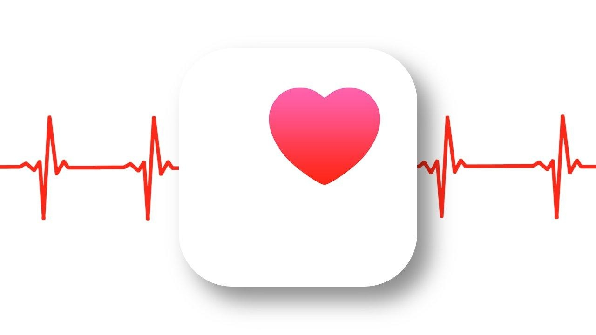
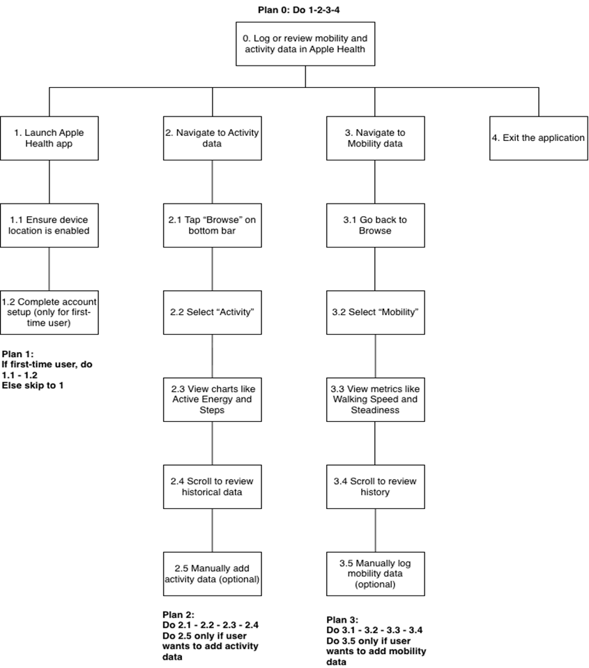
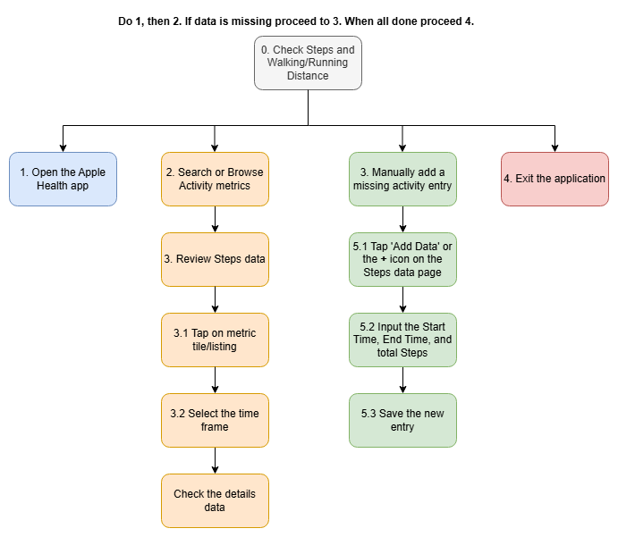
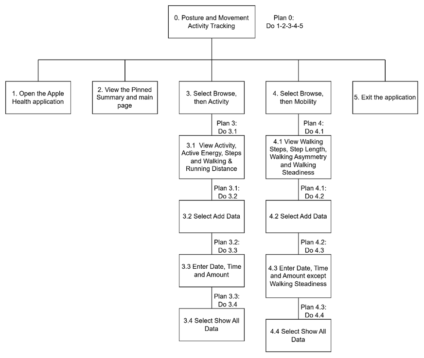
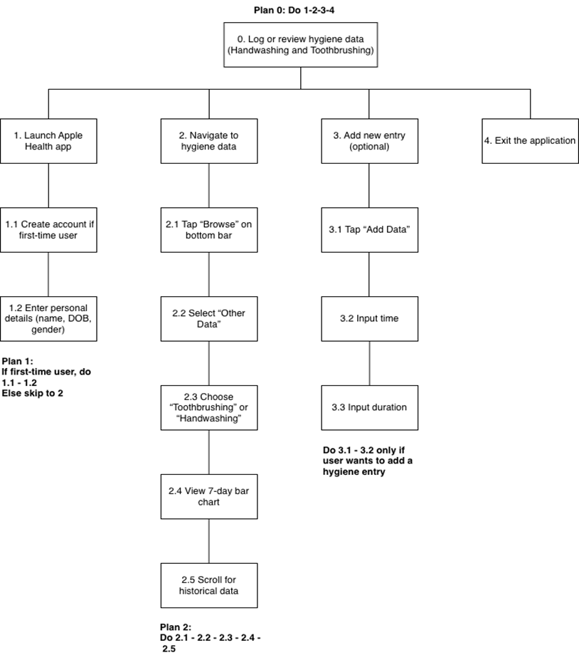
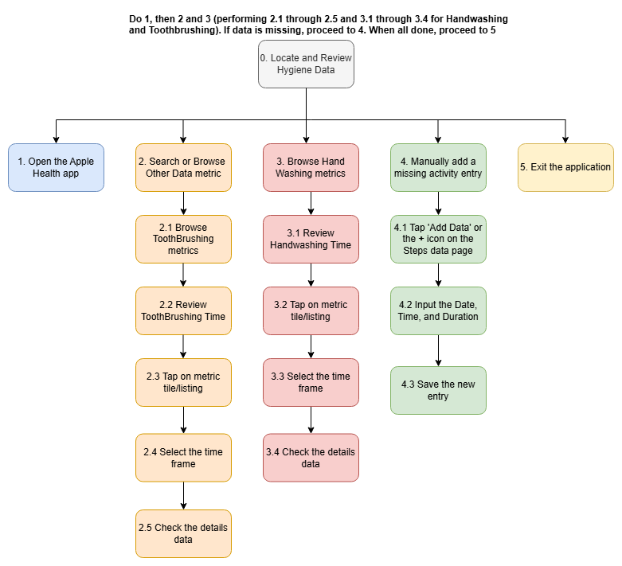
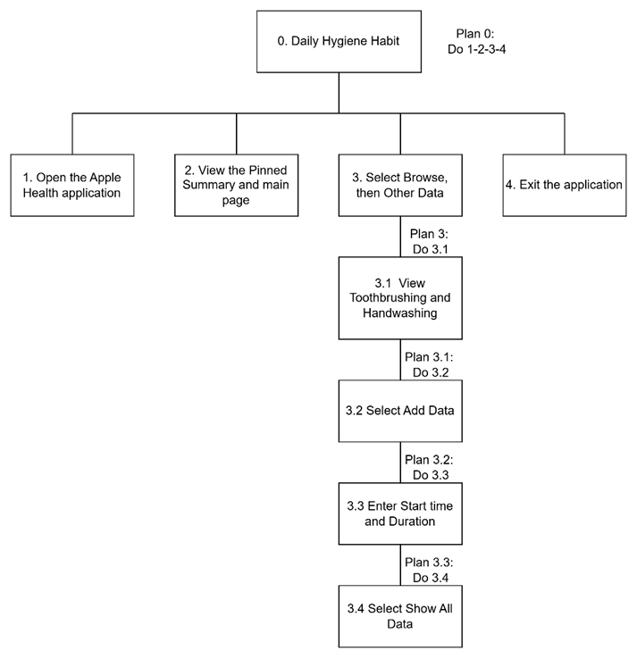
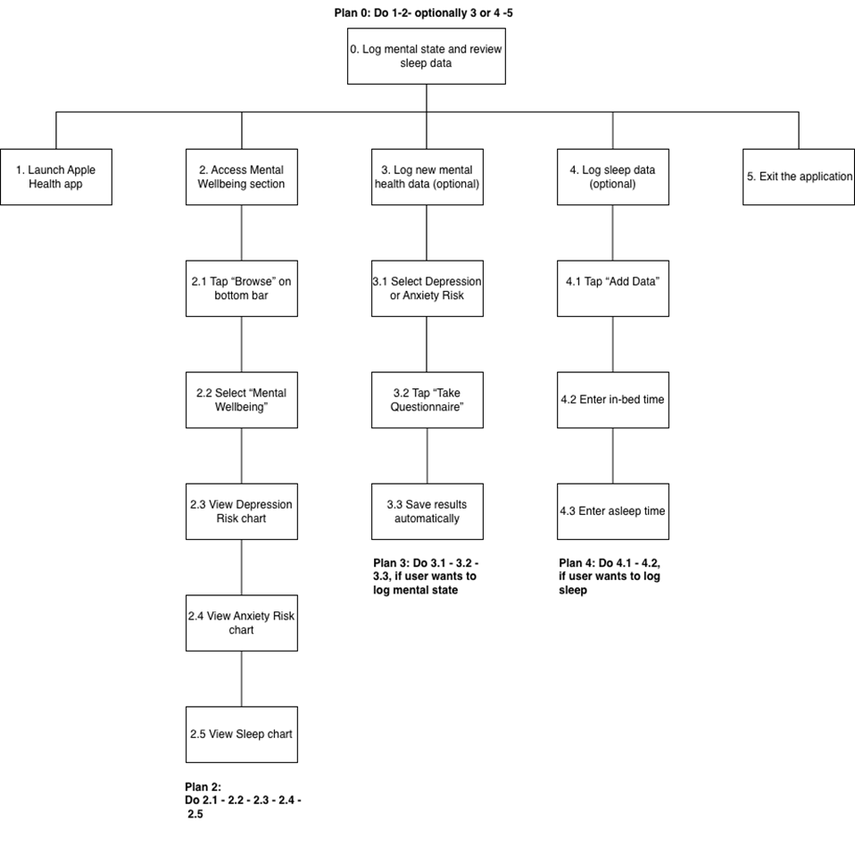
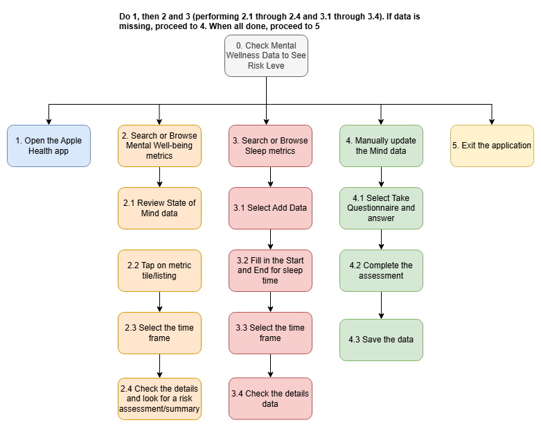
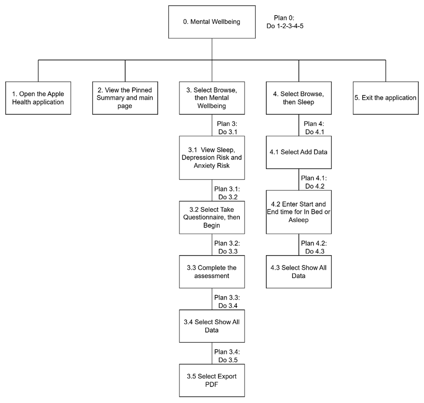

# Gathering Requirements - User Analysis

## 1.0 Proposed Tasks

Three core tasks have been identified based on the system’s functional model, including posture monitoring, hygiene hub, and mind mender, to understand how users will interact with Health Guard AI. These tasks are presented to the realistic user goals and form the basis for scenario development later, task analysis, and interface design. Here are the three main tasks identified:

### Monitor and Correct Posture Using Posture Guard

This functional task focuses on the posture module where the user will activate the Posture Guard module while working or studying. The system will use the device's camera to monitor the user's sitting position in real-time. When improper posture is detected, such as slouching, leaning, or forward head tilt, the system will immediately alert the user with subtle haptic vibrations, soft auditory cues, or non-intrusive visual alerts. It will also display visual guidance to help the user make corrective adjustments. This task aims to improve ergonomics and reduce the risk of musculoskeletal strain.

### Complete a Gamified Hygiene Routine

This functional task focuses on users’ habit formation. Users will interact with the Hygiene Hub module by receiving hygiene reminders or scheduled wellness activities such as handwashing, toothbrushing, or taking a screen break. Users respond to reminders by logging completed activities or following guided instructions. For example, an AR-guided handwashing tutorial overlays on the real-world sink, or a gamified stretching routine is provided. After completion, users are rewarded with points, badges, or progress on a "Wellness Quest," making healthy practices engaging and rewarding.

### Log Emotional State and Receive a Personalized Mindfulness Activity

This task focuses on mental well-being by involving the Mind Mender module. Users log their current mood and emotional state by writing private journal entries. The system processes this input locally on the device to protect users' privacy and generates personalized recommendations for coping solutions or meditation exercises. Examples include breathing exercises, cognitive reframing prompts, or calming activities. Users engage and follow the suggested activity to complete this task.

---

## 2.0 Persona

### 2.1 Persona 1

**Name:** Canie  
**Age:** 45 years old  
**Occupation:** Clerk in her family's business and mother of four children  

**Background:**  
Canie’s workday is divided into two parts: managing childcare and daily chores at home, and four hours at the office desk managing inventory and digital work. She struggles with switching between "work mode" and "mom mode" and experiences chronic shoulder and back pain due to a non-ergonomic office setup. Her daily stress levels are high due to the mental strain of balancing both duties.

**Needs:**  
Canie seeks easy and effective solutions to reduce mental stress and avoid physical strain that could lead to chronic injury. She needs a healthcare system that is easily accessible on her device and provides flexible guidance for her home and office lifestyles.

**How Health Guard AI Helps:**  
- The Posture Guard module monitors her posture while working and provides gentle reminders to release tension before it becomes painful.  
- The Mind Mender module offers discrete and quick support to manage her mental load.

### 2.2 Persona 2

**Name:** Akram Faisal  
**Age:** 25 years old  
**Occupation:** Full-time software engineer  

**Background:**  
Akram has been working from home for the past two years. His work requires long hours of deep focus in front of multiple monitors. This has resulted in prolonged sedentary behavior, occasional neck and shoulder strain, and feelings of social isolation. Akram prioritizes productivity and efficiency.

**Needs:**  
Akram wants to avoid long-term health problems, including burnout and persistent back pain. He struggles with self-regulating breaks, lacks an ergonomic setup, and experiences mental strain from limited social connections.

**How Health Guard AI Helps:**  
- Provides a flexible, data-driven solution that integrates seamlessly into his digital workflow.  
- Offers gamified engagement to encourage healthy habits without disrupting productivity.

### 2.3 Persona 3

**Name:** Tan Yi Jie  
**Age:** 26 years old  
**Occupation:** Office Worker at Prudential  

**Background:**  
Tan Yi Jie spends her workday reviewing market data and producing complex reports. She often works through lunch and late into the evening to meet deadlines. This nonstop working condition causes neck and lower back pain due to prolonged sitting and poor posture. She also suffers from high-functioning anxiety, which leads her to neglect breaks and hydration.

**Needs:**  
Tan Yi Jie aims to maintain productivity and professional health to ensure long-term success and avoid burnout. She requires immediate and gentle health support that fits into her busy schedule.

**How Health Guard AI Helps:**  
- Monitors and corrects unhealthy habits in real-time without disruptions.  
- Provides quick stress management solutions through a chat-based platform.

---

## 3.0 Scenario

### Task 1: Monitor and Correct Posture Using Posture Guard

At the family business office, Canie is rushing to complete inventory data before picking up her kids. She is sitting at an old, non-ergonomic workspace, leaning over the computer. She feels stress increasing on her shoulders and chronic back pain. Canie opens the Health Guard AI app on her phone, sets it up next to her monitor, and starts the Posture Guard session. The app detects her forward head tilt and slumping form, sending a gentle vibration to alert her. She adjusts her posture, reducing pain and maintaining energy for her family responsibilities later.

### Task 2: Complete a Gamified Hygiene Routine

Akram, a passionate software engineer, spends hours coding. His eyes are tired, and his fingers are stiff, but he avoids breaks to maintain productivity. The Hygiene Hub sends a vibrant reminder: "Time for a Brain Recharge! Quest: Wellness Warrior." Akram starts a 5-minute AR-guided stretching practice. After completing the routine, the app rewards him with points, validating that productivity and health can coexist.

### Task 3: Log Emotional State and Receive a Personalized Mindfulness Activity

Tan Yi Jie, an office worker, feels mentally exhausted after a difficult financial review meeting. She quickly types a journal entry about her mood using the Mind Mender module. The system generates a 90-second cognitive reframing reminder and a short breathing exercise. This quick and private solution helps her regain focus for her next client call.

---

# Gathering Requirements - Task Analysis

## 1.0 Introduction

The existing system chosen for the Task Analysis and User Observation is the Apple Health application on an iOS device. This application provides a detailed health data tracker and collector, including information on mental health, daily hygiene, and physical activity. It serves as a useful starting point for analyzing data visualization, navigation, and user interaction patterns in a health context, influencing the design of our proposed Health Guard AI system.

## 2.0 Derivation of HTA

### 2.1 HTA for Task 1

#### User 1: Parents
Video Link: https://youtu.be/qfMBJwH2kFE 

1. The user starts by launching the Apple Health application, requiring a device with location services enabled. 
2. A first-time user must complete an account setup by entering personal details.
3. On the main page, the user taps the 'Browse' option in the bottom bar.
4. Within the 'Browse' menu, the user selects 'Activity' to review metrics like Active Energy and Steps displayed in bar charts.
5. The user can scroll to view historical data or choose to manually add entries.
6. The user can go back to the 'Browse' menu and select 'Mobility' to access metrics such as Walking Speed and Walking Steadiness presented in various chart formats.
7. The user can review historical information or manually log data for most metrics.
8. The task is complete once the user closes and exits the application.

**The overall goal** is to log and review mobility and activity data in the Apple Health app.

#### User 2: Remote Workers
Video Link: https://youtu.be/9nXktWmM8nc

1. The user opens the Apple Health application.
2. If the user is new, they must first create an account by providing their name, date of birth, and gender.
3. On the main page, the user taps the “Browse” option in the bottom navigation bar.
4. To use this application, your location service must stay online.
5. To see the activity, users need to press on the Activity categories, then can have a look at the Activity.
6. There are calories that are used today, active energy calories used past 7 days and resting energy and more such as steps.
7. Users can manually add the activity entry if they are not provided by connecting to some specific sports or motion devices.
8. Users can simply add their activity and have a look at their activity what they have done in real time through the application.

#### User 3: Office Workers
Video Link: https://youtu.be/3E2QXAX8WoQ

1. The user launches the Apple Health application.
2. Upon opening, the Pinned Summary appears on the main page.
3. The user must ensure that the device is connected to the Internet and that location services are enabled.
4. For first-time users, an account setup is required, involving entering basic personal information such as name, date of birth, and gender.
5. At the bottom navigation bar, the user may select Summary, Sharing, or Browse.
6. To proceed, the user taps Browse, then selects Activity.
7. This section displays metrics such as Activity, Active Energy (kcal), Steps, and Walking & Running Distance.
8. Each metric is presented using bar charts, and by scrolling downward, the user can view the complete historical data.
9. The user may also manually add entries for these activity metrics.
10. Next, under the Browse tab, the user can select Mobility.
11. This section presents measurements such as Walking Speed, Step Length, Walking Asymmetry, and Walking Steadiness.
12. Each metric displays different formats of charts, and you can scroll down to view historical information about them.
13. Users may manually add data for all mobility metrics except Walking Steadiness.
14. After reviewing summaries or inputting data, the user may close and exit the application.

**Findings from the HTAs for Task 1: Check Posture and Physical Activity Data**

Based on HTAs on Task 1, all of the three users tried to use the Apple Health app to view their physical activity statistics such as Steps, Distance, and Active Energy. The data collected through the observation showed that the main issue shared by users was efficiency and relevance. Since these directly connect to their aims for maintaining physical health during prolonged sitting, users wanted to see high-level activity numbers as quickly as possible.

In general, all users followed the standard flow to use the initial Pinned Summary to navigate the detailed data through the Browse tab. However, a major structural problem found was the separation of related data which required users to check 'Activity' for Steps and then return to 'Browse' to check 'Mobility' for detailed walking metrics. The user needs a fast and high-level review while it needs multi-step navigation which slows down the overall job flow by separating related data.

The specific differences in results showed how people are affected by this inefficiency. For Canie, a Working Mother or Clerk, the two-stage navigation caused a lot of friction that wasted her limited time for health review. The Office Worker, Tan Yi Jie, although she can quickly jump to the Summary, the complicated detailed navigation was still too slow for her efficiency goals. The remote worker, Akram was less patient with the system's manual data entry and concentrated more on KPIs like Active Energy and the dependence on automated device tracking. The input method is a waste of time for regular and easy use, all users who tried manual input repeatedly stop because they were worried about entering incorrect data or confused about the necessary time parameters (Start Time/End Time).

### 2.2 HTA for Task 2

#### User 1: Parents
Video Link: https://youtu.be/ErPgm12AMF4 

1. The user starts by opening the Apple Health application.
2. If the user is new, they must first create an account by providing their name, date of birth, and gender.
3. On the main page, the user taps the 'Browse' option from the bottom bar.
4. The user then selects 'Other Data' to view data entries from the past seven days.
5. From the list of activity categories, the user chooses either 'Toothbrushing' or 'Handwashing' to view the specific data presented in a bar chart format.
6. The user can scroll down to review historical data.
7. The user can add an entry manually by specifying the time and duration of the activity.
8. Once the review or data entry is complete, the user closes and exits the application.

**The main plan** is a sequence of navigating to the data and reviewing it with an optional step to add new information. The goal is to check hygiene data for Toothbrushing and Handwashing in the Apple Health app.

#### User 2: Remote Workers
Video Link : https://youtu.be/9FRWzaJQ7eI 

1. The user opens the Apple Health application.
2. If the user is new, they must first create an account by providing their name, date of birth, and gender.
3. On the main page, the user then taps the “Browse” option in the bottom navigation bar.
4. Choose Other Data.
5. Inside there is Toothbrushing, hand washing, and a lot more data that can be chosen.
6. Users can tap in the specific data they wanted and have a look at it.
7. There is a graph showing our weekly hygiene.
8. Users can manually input hand washing data or toothbrushing data by tapping + symbol above and type in how many seconds washed or etc to insert the dataset.
9. After the end, close the interface and its end of a task.

#### User 3: Office Workers
Video Link: https://youtu.be/LbUyjBFpzjw

1. The user opens the Apple Health application, where the Pinned Summary will appear on the main page.
2. Ensure that the device is connected to the Internet.
3. First-time users will need to create an account by providing their name, date of birth, and gender.
4. From the bottom navigation bar, the user may select Summary, Sharing, or Browse.
5. The user taps Browse, then selects Other Data, which displays data entries recorded within the past seven days.
6. The user may choose activity categories such as Toothbrushing or Handwashing.
7. Each category presents its data in a bar chart format, with historical data available by scrolling down.
8. Users may manually add entries by specifying the time and duration of each activity.
9. Once the user has finished reviewing or adding data, they may close and exit the application.

**Findings from the HTAs for Task 2: Record and Review Hygiene Data**

Based on HTAs on Task 2, all users navigated the Apple Health application with the objective of discovering and reviewing hygiene metrics, the Handwashing and Toothbrushing metric. The poor classification and visibility were the biggest issues that all users faced. Users complained that these daily habits were not given a clear and noticeable section, all users need to navigate through the multi-step Browse to Other Data step. This categorization of essential metrics under a general heading like "Other Data" conflicts with users' goal which is building good habits, as it minimized the importance of this data.

The differences in results showed clearly how this structural problem affected different users. For Canie, the Working Mother/Clerk the long work time caused tension which increased her risk of task leaving due to her limited time. The Office Worker, Tan Yi Jie, had patience but showed dislike in her thought process because the incorrect arrangement conflicted with her need for systematic efficiency. The Remote Worker was also ineffective when trying to use the search bar showing the data was logically misclassified. Overall, because it took too many steps and too much mental work to find the data, the system was unable to serve the habit-formation goal.

### 2.3 HTA for Task 3

#### User 1: Parents
Video Link: https://youtu.be/SEcmRVWpOOk 

1. The user starts by opening the Apple Health application.
2. The user then navigates to the "Browse" section using the bottom menu.
3. Within Browse, the user selects the "Mental Wellbeing" category to view their data.
4. Here, the user can see previously recorded information for "Depression Risk", "Anxiety Risk" and "Sleep", each displayed with its own chart.
5. To log new mental health data, the user can tap "Take Questionnaire" under Depression or Anxiety Risk, and the results are saved automatically.
6. For sleep, the user can manually "Add Data" by specifying in-bed and asleep time. The app will automatically calculate the duration.
7. After reviewing the historical data by scrolling or adding new entries, the user can exit the application.

**The plan** is a sequential process of navigating to the Mental Wellbeing section, then choosing to either review existing data or log new information for both mental state and sleep before exiting. The overall goal is to log mental state and review sleep data in the Apple Health app.

#### User 2: Remote Worker
Video Link : https://youtu.be/TxIdsu5UXTQ

1. The user opens the Apple Health application.
2. If the user is new, they must first create an account by providing their name, date of birth, and gender.
3. On the main page, the user then taps the “Browse” option in the bottom navigation bar.
4. After that, choose mental wellbeing.
5. Inside mental wellbeing, there is anxiety risk, depression risk, sleep, and more.
6. To record this, users need to do a questionnaire to make a test for reflection, assessing users' current risk of common conditions.
7. The application automatically calculates the duration and updates the historical records.
8. Users can check their mental wellbeing in real-time after answering questions to ensure that they have a healthy mental state all the time.

#### User 3: Office Workers
Video Link: https://youtu.be/SBmayEAPJx0

1. The user opens the Apple Health application, where the Pinned Summary appears on the main page.
2. Connect the device to the internet.
3. Before using it for the first time, the user must complete the account setup by providing their name, date of birth, and gender.
4. Users also have the option of viewing the bottom menu of Summary, Sharing, and Browse.
5. Using the bottom menu, the user may choose between Summary, Sharing, and Browse.
6. The user selects Browse, followed by Mental Wellbeing.
7. This section displays data previously recorded under categories such as Depression Risk, Anxiety Risk, and Sleep, each presented with its respective chart type.
8. Historical data can be viewed by scrolling downward.
9. For Depression Risk and Anxiety Risk, users may complete the built-in questionnaires by selecting Take Questionnaire, then tapping Begin to start the assessment.
10. The results are saved automatically, and users may export them as a PDF file.
11. For Sleep, users may manually add entries by specifying the in-bed time, asleep time, and other relevant details. The sleep data can also automatically be imported from Apple Watch.
12. The application automatically calculates duration and updates the historical data.
13. After completing the review or adding new information, the user may exit and close the application.

**Findings from the HTAs for Task 3: Check Mental Wellness Risk Level**

Based on HTAs on Task 3, all users were going the same steps to navigate to the Mental Wellness section to review their mental health data and risk. The data showed that the main problem faced by users was the high-friction barrier needed to get immediate support. Users wanted to manage stress but found that the system's process was too complex. Generally, all users followed the path of Browse and went to Mental Wellness where data like Depression Risk, Anxiety Risk, and Sleep were there but the system needed to "Take Questionnaire" for risk assessment which is the main problem. This requires a long commitment of time and mental energy, failing to meet the user's need for instant stress relief.

The differences in results showed how this commitment is affected by different users. First, for Canie the Working Mother/Clerk she thinks that the different input methods caused confusion and frustration to make the tool feel inconsistent. While for the Office Worker, Tan Yi Jie, she thought the "Take Questionnaire" was the problem because she needed immediate and private assistance during a work situation and the formal test was too complex to complete, making the system ineffective for stress. The Remote Worker liked the detail of the questionnaire but the time commitment stopped them from using this function often. This limits the use of the app for regular analysis. All users noticed that the difference in input methods which is Sleep allows easy manual data entering but the person must do a long test for anxiety risk. The software is ineffective for quick mood tracking because it lacks consistent and straightforward input.

---

## 3.0 Design Requirements 

Based on a comprehensive analysis of Hierarchical Task Analyses (HTA) and the accompanying "Thinking Aloud" commentary from our three user groups, we have noticed some core design requirements and improvements for Health Guard AI. These specifications are necessary to develop an application that is not only functionally, but also reliable, efficient, and learnable.
 
1. **Immediate access to core health information:** The system should display important posture, hygiene, and mental health data directly on a clear dashboard without requiring complex navigation.
 
2. **Gamification elements:** Incorporate gamification components like points, badges, and progress indicators to encourage and promote consistent hygiene and wellness practices.
 
3. **Quick action mental well-being support:** Provide a fast and instant method for users to record their emotions and get immediate mindfulness support.
 
4. **Privacy-focused local data processing:** Default to processing sensitive emotional and mental health data locally on the user's device to ensure privacy.
 
5. **Simple progressive and understandable feedback:** Help users understand habits over time without overwhelming detail, providing clear trends and succinct explanations.

