# Project 3 - Design Documentation

## Table of Contents

1. [Storyboards](#storyboards)
   - [Task 1: Monitor and Correct Posture Using Posture Guard](#task-1-monitor-and-correct-posture-using-posture-guard)
   - [Task 2: Complete a Gamified Hygiene Routine](#task-2-complete-a-gamified-hygiene-routine)
   - [Task 3: Log Emotional State and Receive a Personalized Mindfulness Activity](#task-3-log-emotional-state-and-receive-a-personalized-mindfulness-activity)
2. [Alternative Designs](#alternative-designs)
3. [Wireframes](#wireframes)
4. [Interaction Metaphors](#interaction-metaphors)

---

## 1.0 Storyboards

### 1.1 Task 1: Monitor and Correct Posture Using Posture Guard

**Scene 1**  
The user is working for hours at the laptop and complaining about her neck pain.

**Scene 2**  
The user checks for the notification from Health Guard AI.

**Scene 3**  
The application shows warning to remind user for having a better posture.

**Scene 4**  
The user reflects on poor posture.

**Scene 5**  
The user adjusts posture based on the instructions given by the application.

**Scene 6**  
The user continues to work comfortably after noticed and adjusted poor posture.

---

### 1.2 Task 2: Complete a Gamified Hygiene Routine

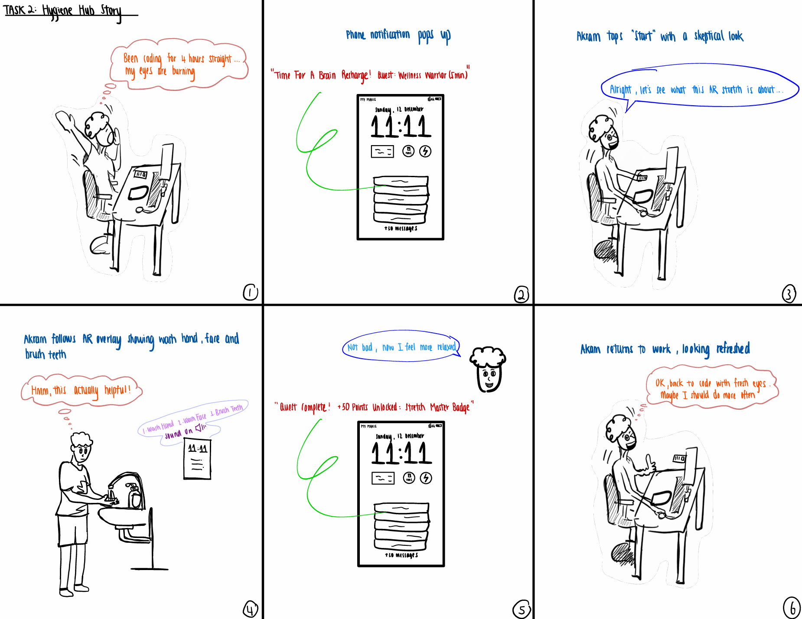

**Scene 1**  
The user feels burning eyes and tired after coding for hours.

**Scene 2**  
The Health Guard AI notify the user to step away from work.

**Scene 3**  
The user views an Augmented Reality (AR) shows on the phone that offers user to washing hands, face and brushing teeth.

**Scene 4**  
The user performs the hygiene tasks based on the AR guide and feels the guidance helpful.

**Scene 5**  
The user completes the tasks and gets reward points.

**Scene 6**  
The user feels refreshed and productive after completed the gamified hygiene routine.

---

### 1.3 Task 3: Log Emotional State and Receive a Personalized Mindfulness Activity

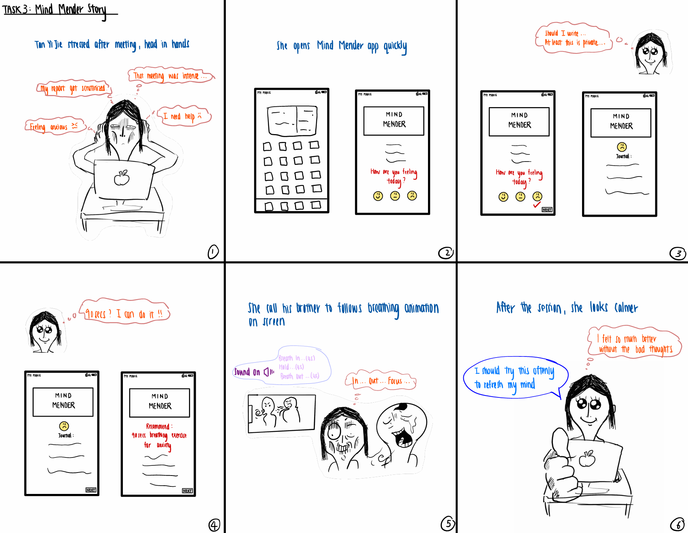

**Scene 1**  
The user feels stressed and anxious after meeting.

**Scene 2**  
The user immediately chooses to open the Health Guard AI.

**Scene 3**  
The user logs mood and writes a journal in the application.

**Scene 4**  
The application gives a recommendation activity to the user based on the analysis from journal.

**Scene 5**  
The user performs the activity by following the animation instruction.

**Scene 6**  
The user feels relaxed after the activity.

---

## 2.0 Alternative Designs

### 2.1 Edwin Tan Yee En

### 2.2 Quah Zhen Yee

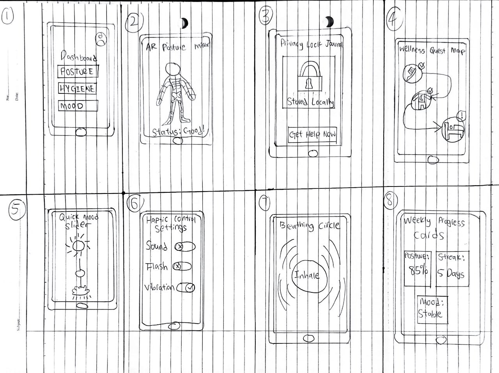

### 2.3 Lee Wei Xuan

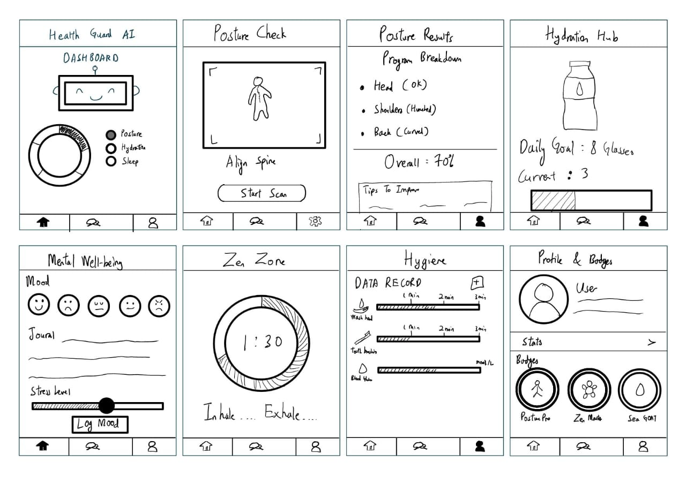

### 2.4 Fion Tee Xin Yue

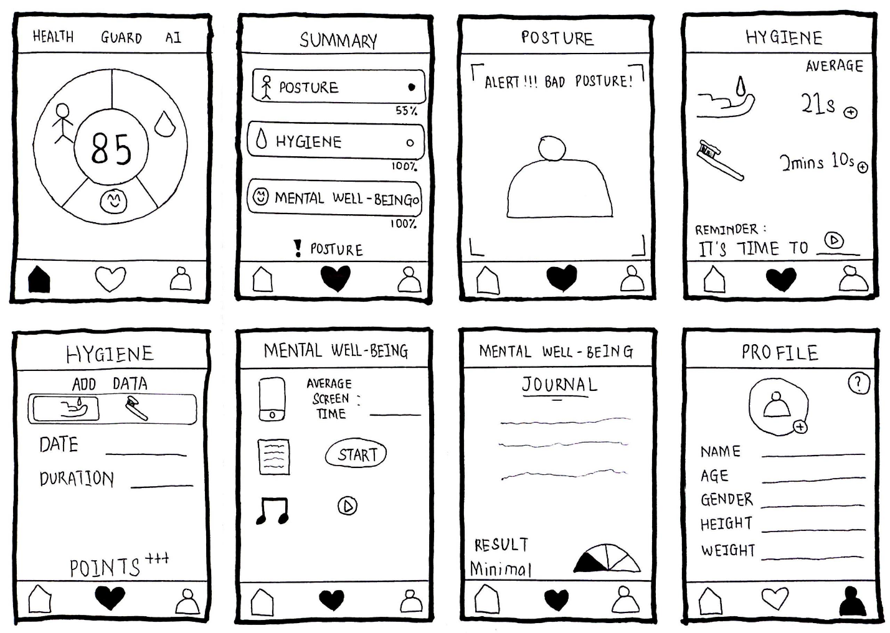

### 2.5 Lim Zoey

---

### 2.6 Scan of Voted Design Layouts

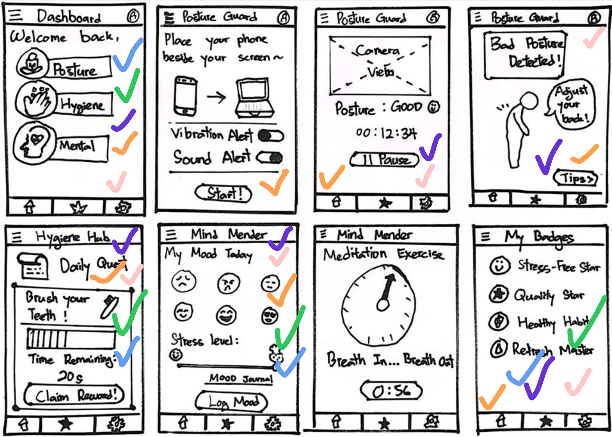

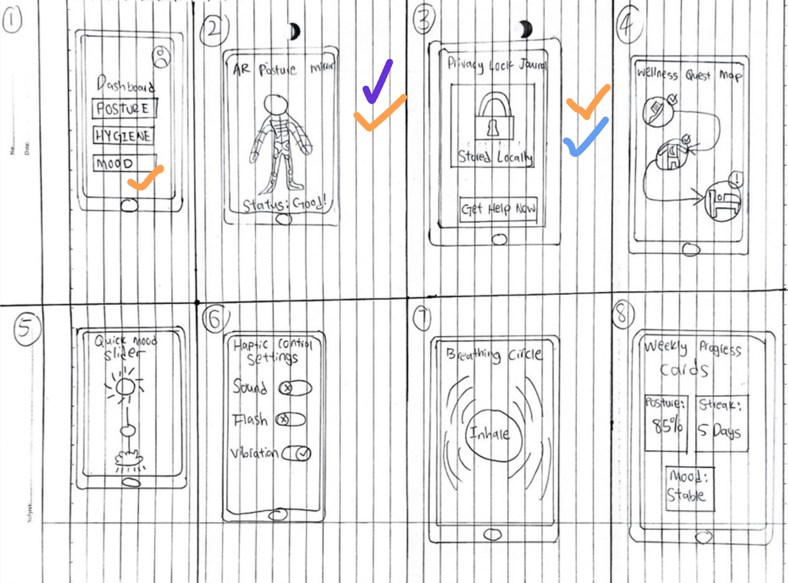

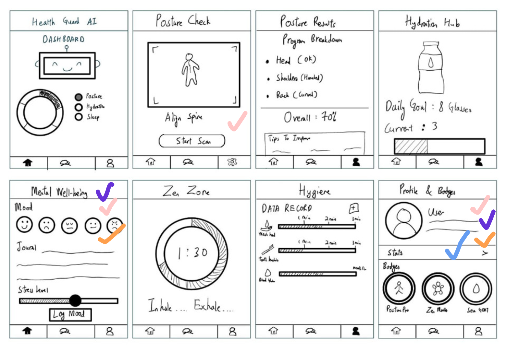

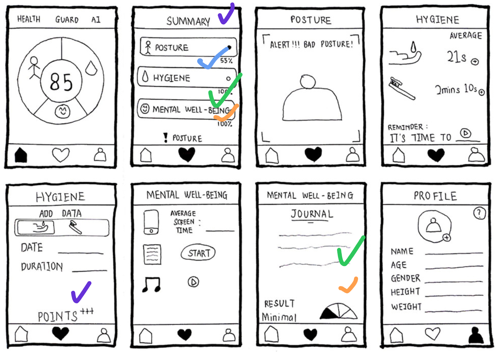

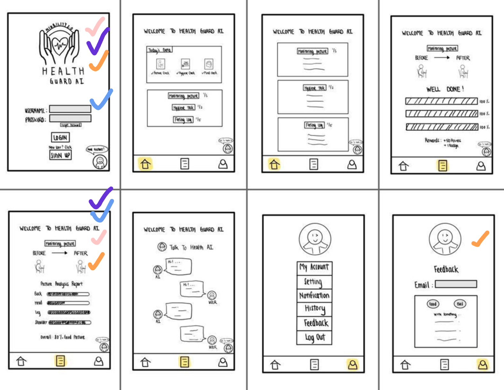

**Voting Results:**

1. **Edwin Tan Yee En** – vote for everyone  
   *Reason: Everyone's layouts has its own details and advantages.*

2. **Quah Zhen Yee** – vote for Edwin Tan Yee En & Fion Tee Xin Yue  
   *Reason: Their layouts look most user-friendly, simple and nice.*

3. **Lee Wei Xuan** – vote for everyone  
   *Reason: We should take the pros and remove the cons to get a better layout.*

4. **Fion Tee Xin Yue** – vote for Edwin Tan Yee En, Lee Wei Xuan & Lim Zoey  
   *Reason: Their layouts should be combined together to show more accurate to our goals.*

5. **Lim Zoey** – vote for everyone  
   *Reason: All the layouts should be combined appropriately to produce the best layout.*

---

## 3.0 Wireframes

### 3.1 Task 1: Monitor and Correct Posture Using Posture Guard

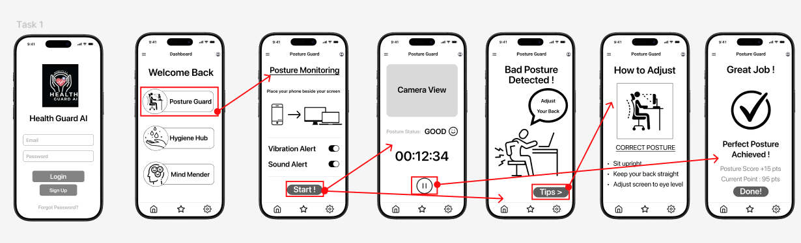

### 3.2 Task 2: Complete a Gamified Hygiene Routine

### 3.3 Task 3: Log Emotional State and Receive a Personalized Mindfulness Activity

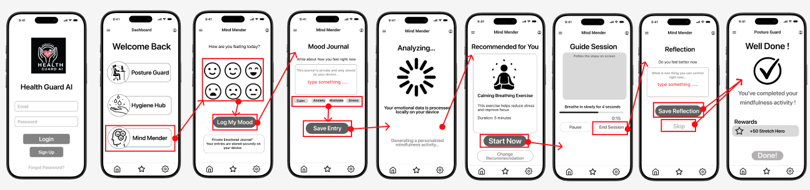

---

### 3.4 Justification of the Design

In the design of the Health Guard AI, we combined few of Gestalt Principles and Shneiderman's Eight Golden Rules to develop user friendly, efficient and instinctive interfaces.

#### Gestalt Principles:

**Similarity:** A direct application of this principle can be observed in our dashboard and navigation bars. The three core buttons in our dashboard ("Posture Guard", "Hygiene Hub", "Mind Mender") possess a similarity in both shape, size, and visual style. This will help users find the primary elements easily and able to access core functions immediately. Moreover, the system bears a bottom navigation bar named "Home," "Favourites," "Settings," which remains constant on all screens.

**Proximity:** The principle can be observed in the "Mood Journal" and "Settings" screens. When users logged their mood, the emotion icon (faces) that represent different modes are placed side by side to show that they belong to a common input. Further, In Posture Monitoring settings, the "Vibration Alert" and the "Sound Alert" buttons are also placed side by side to indicate their same configuration category.

**Figure and Ground:** This principle applied in the "Posture Guard" camera view. The digital posture guide (figure) appears upon the user's camera (ground) so that both are distinguishable through the environment.

#### Shneiderman's Eight Golden Rules:

**Offer Informative Feedback:** A clear and immediate feedback is given when each action is performed by a user. For example, when user give a wrong posture, the system will immediately show a message "Bad Posture Detected" and follow by a instruction "Adjust Your Back", for ensure user could receive immediate feedback. After user complete a task, system will also display message like "Great Job" and "Well Done!" to confirm user success.

**Strive for Consistency:** The principle of consistency could observed in navigation and terminology. The "Start" and "Done!" buttons were in the same location across every modules (Posture Guard, Hygiene Hub, Mind Mender), this will lessen the learning curve of the users. The bottom navigation bar is always present, making it easy for the users to locate where they are in any page.

**Support Internal Locus of Control:** The system puts control in the hands of the user rather than controlling them. For example, instead of an automatic "Start" in Posture Guard's posture tracking, and also the "Log My Mood" in Mind Mender, it gives control to user to decide their actions. Beside that, user also in control to choose and customize their alert preferences (Vibration/Sound) by not disturbing them.

---

## 4.0 Interaction Metaphors

The Health Guard AI application utilizes several intuitive interaction metaphors to ensure users can navigate and interact with the system effectively. Below is a comprehensive table of all interactive icons and their functions:

| **Icon Name** | **Location** | **Function** |
| --- | --- | --- |
| **Menu Icon** | Top left of the screen | A hamburger menu button that opens the side expand menu. User can access secondary features like History (view past data of postures or moods), Help/FAQ (get help or frequent ask questions), and Log Out. |
| **Profile Icon** | Top right of the screen | A profile button that opens the profile page. Users can access and edit their personal details such as name, age, gender, height, and weight. |
| **Home Icon** | Bottom left of the screen | A home button that allows users to return to the home page (dashboard) instantly from anywhere in the app. |
| **Star Icon** | Bottom center of the screen | An achievement and summary button. Users can view all their summarized data and achievements. Gamification elements (current Streak, XP points, Level) are displayed in this page. |
| **Gear Icon** | Bottom right of the screen | A settings button that allows users to control and customize their preferences, including alert types and notification settings. |

---

## Conclusion

This comprehensive design documentation showcases our iterative design process for Health Guard AI. Through collaborative effort and multiple design alternatives, we've created user-centered wireframes that incorporate established design principles. Our storyboards illustrate real-world usage scenarios, while our interaction metaphors ensure intuitive navigation. The application of Gestalt Principles and Shneiderman's Eight Golden Rules demonstrates our commitment to creating an effective, efficient, and engaging user experience.

---

*Project 3 completed by Group 3 - niubility 2.0*