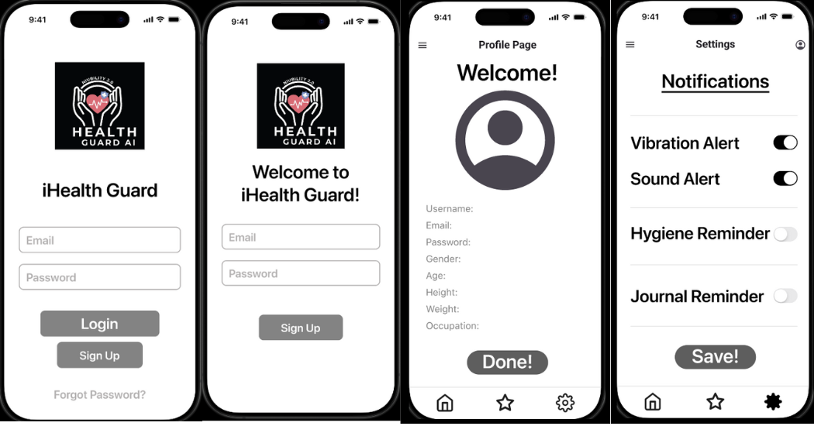
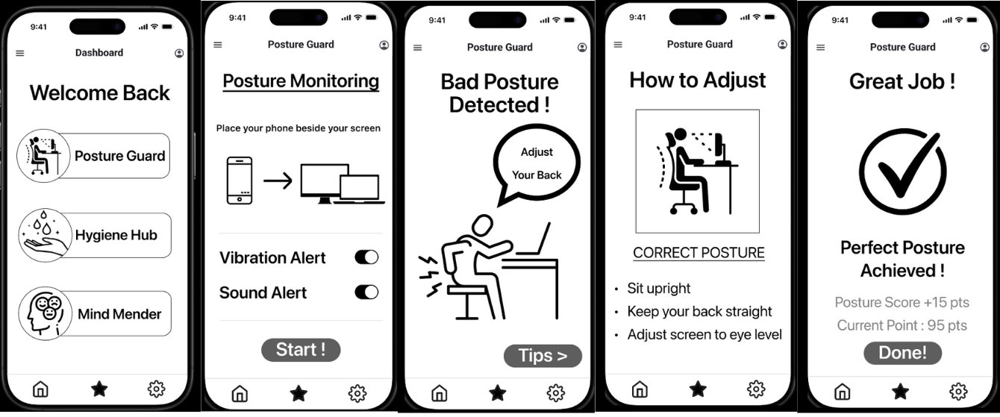
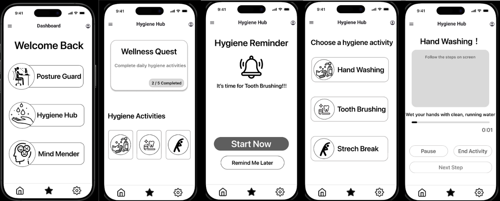
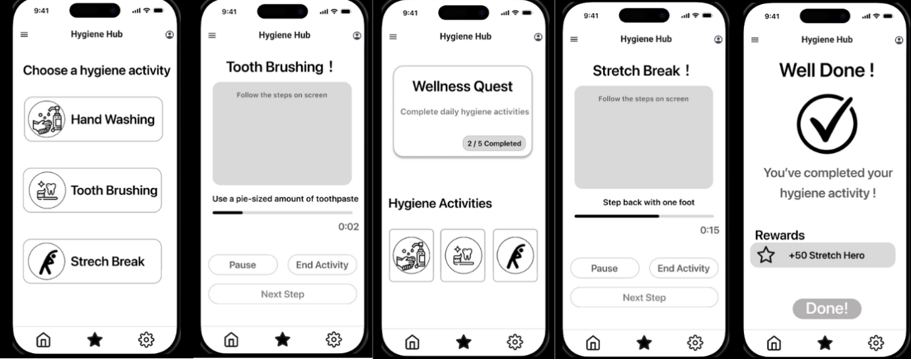
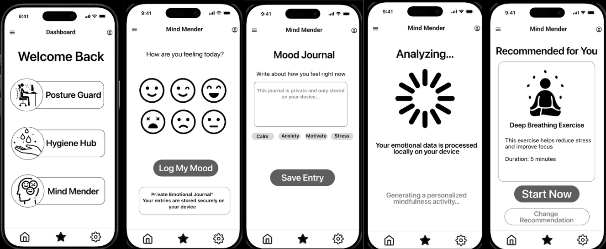
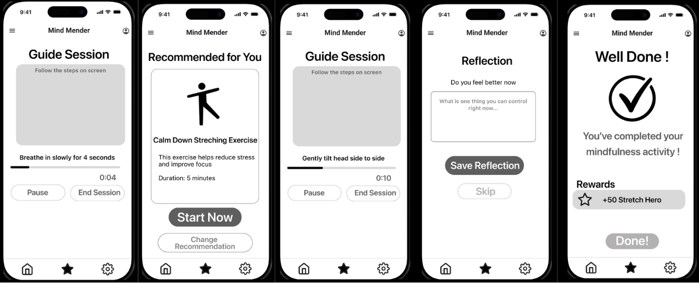

# HCI Phase 4 Report

## 1. Introduction

The iHealth Guard project was initiated due to growing health concerns associated with prolonged use of digital devices, stemming from issues such as poor posture, hygiene neglect, and mental fatigue. In this phase, we developed a high-fidelity prototype using Figma with the objective of emulating a medium-to-high “look and feel” of the final application. The main goal of the usability testing was to evaluate how well the interface helps users while adhering to established design guidelines such as the Gestalt Principles and Shneiderman’s Eight Golden Rules.

The testing sessions were conducted with our personas through both physical and online methods. To ensure convenience for our testing users, they used mobile devices during the sessions. A total of three users participated, representing a cross-section of our target user groups, including parents, remote workers, and office workers. This ensured the prototype reflected a wide range of users’ needs and expectations.

To ensure smooth data collection, tasks were divided among team members. User 1’s usability testing was conducted by Lim Zoey, User 2’s by Lee Wei Xuan, and User 3’s by Fion Tee Xin Yue. These activities comprised a briefing, task performance, and an interview at the end, following the "think-aloud" methodology.

## 2. Screenshots of Prototype

### 2.1 Login, Sign Up, Settings, Profile Page

### 2.2 Task 1: Posture Guard Monitoring

### 2.3 Task 2: Hygiene Hub

### 2.4 Task 3: Mind Mender

## 3. Briefing Notes

Prepared by Lee Wei Xuan

Good day Sir/Madam,

We are Team Niubility 2.0 from HCI Section 08 Group 3. Thank you for joining this usability testing session. My name is [Name], and I will be facilitating this session.

Our system is called iHealth Guard, a wellness companion app designed to help users maintain healthy habits through posture monitoring, hygiene reminders, and mindfulness activities.

Today, you will be testing three tasks using our prototype in Figma. While testing, please tell us what you’re thinking, feeling, or any difficulties you encounter. If at any point you feel stuck or unable to complete a task, please say “Stop,” and we will move to the next task.

Before we begin, may I have your verbal consent to participate and be recorded? If you agree and understand everything I’ve said, please reply “Yes.” If not, please reply “No.”

## 4. Testing with Users

### 4.1 Task 1

#### 4.1.1 Video: User 1 (Parent Testing)

  <iframe width="560" height="315" src="https://www.youtube.com/embed/FY-evIZ31Os" title="User 1 Parent Testing" frameborder="0" allow="accelerometer; autoplay; clipboard-write; encrypted-media; gyroscope; picture-in-picture" allowfullscreen></iframe>

#### 4.1.2 Video: User 2 (Remote Worker Testing)

  <iframe width="560" height="315" src="https://www.youtube.com/embed/iWYyRKBn_Ws" title="User 2 Remote Worker Testing" frameborder="0" allow="accelerometer; autoplay; clipboard-write; encrypted-media; gyroscope; picture-in-picture" allowfullscreen></iframe>

#### 4.1.3 Video: User 3 (Office Worker Testing)

  <iframe width="560" height="315" src="https://www.youtube.com/embed/A_tsNRsMHVs" title="User 3 Office Worker Testing" frameborder="0" allow="accelerometer; autoplay; clipboard-write; encrypted-media; gyroscope; picture-in-picture" allowfullscreen></iframe>

### 4.2 Task 2

#### 4.2.1 Video: User 1 (Parent Testing)

  <iframe width="560" height="315" src="https://www.youtube.com/embed/VYsi654USGk" title="User 1 Parent Testing Task 2" frameborder="0" allow="accelerometer; autoplay; clipboard-write; encrypted-media; gyroscope; picture-in-picture" allowfullscreen></iframe>

#### 4.2.2 Video: User 2 (Remote Worker Testing)

  <iframe width="560" height="315" src="https://www.youtube.com/embed/X2sPjz-1gB0" title="User 2 Remote Worker Testing Task 2" frameborder="0" allow="accelerometer; autoplay; clipboard-write; encrypted-media; gyroscope; picture-in-picture" allowfullscreen></iframe>

#### 4.2.3 Video: User 3 (Office Worker Testing)

  <iframe width="560" height="315" src="https://www.youtube.com/embed/zNmdaMu9WTY" title="User 3 Office Worker Testing Task 2" frameborder="0" allow="accelerometer; autoplay; clipboard-write; encrypted-media; gyroscope; picture-in-picture" allowfullscreen></iframe>

### 4.3 Task 3

#### 4.3.1 Video: User 1 (Parent Testing)

  <iframe width="560" height="315" src="https://www.youtube.com/embed/5xXZQd3yB_M" title="User 1 Parent Testing Task 3" frameborder="0" allow="accelerometer; autoplay; clipboard-write; encrypted-media; gyroscope; picture-in-picture" allowfullscreen></iframe>

#### 4.3.2 Video: User 2 (Remote Worker Testing)

  <iframe width="560" height="315" src="https://www.youtube.com/embed/bhcP0MyoFEg" title="User 2 Remote Worker Testing Task 3" frameborder="0" allow="accelerometer; autoplay; clipboard-write; encrypted-media; gyroscope; picture-in-picture" allowfullscreen></iframe>

#### 4.3.3 Video: User 3 (Office Worker Testing)

  <iframe width="560" height="315" src="https://www.youtube.com/embed/PVkTP3W2Emk" title="User 3 Office Worker Testing Task 3" frameborder="0" allow="accelerometer; autoplay; clipboard-write; encrypted-media; gyroscope; picture-in-picture" allowfullscreen></iframe>

## 5. Observations

### Observation from User 1

Based on the feedback provided by the first user, Madam Canie Teh. She gave great feedback
for overall of our application, and she think that the application was helpful to improve her
quality of life. She said that the feature of our application was interesting, and the user
interface design or layout was clean and easy to understand, mean that our application was
user friendly and able to attract user. But we also receive a complaint from Madam Canie.
The dissatisfied part about our application was the timer for each hygiene task, she thinks that
time given for each hygiene task were not enough for complete the activity. She could not
finish the task before the time run out, which bring inconvenience to her. She suggested that
we could improve the issue by increase time for each hygiene task. 

### Observation from User 2

Our second testing user, Sir Mohamad Akram Bin Mohd Faisal, stated that the iHealth Guard
application offers few notable advantages, which is mainly focused on the user-friendly
design. The application’s interface guided users well with step-by-step instructions and made
the process very easy to navigate. The existence of interesting animations was useful to
attract user’s attention. Additionally, he also said that the application was focused on
addressing common desk related issues, which is suitable for remote workers like him.
However, he thinks that there are some improvements needed for our application. One
significant issue is the hygiene activities, where users need to click manually to move
forward to next step, instead of letting the camera auto-detect the process. Moreover, he also
said that there is lack of a feature of tracking long term data for users. For example, a feature
to store all the previous data like previous postures and moods, for giving users convenience
to observe their progress. 

### Observation from User 3

Based on feedback from third user, Madam Tan Yi Jie. She found that the iHealth Guard
application were very straightforward and easy to use, especially the clarity of the interface.
Additionally, she said about the tips given by the application were accurate and relevant to
her needs. She told us that, she willing to use our application as her personal journal tool to
record her daily emotions, because our application able to process her mood securely.
However, there is also a confusion regarding the icon displayed to users. She gets confused
on the purpose on the gamification icon that appear after completing the hygiene task. 

## 6. Findings

### Prepared by Fion Tee Xin Yue, Lim Zoey

From the user feedback, several usability issues were identified:

By analyzing the data from the users, a few usability problems were identified. The first
usability problem that requires consideration, is stated by Madam Canie Teh, lies in the
presence of strict timing requirements for these hygiene procedures. In her assessment, she
felt that the timer involved was too short for complete the involved activities before its
expiry. In an attempt to correct these deficiencies, a useful approach would be for the
developers to incorporate flexibility in these timers. Instead of an automatic timer that
changes screens, they can make use of a "Mark as Done" button or a user-configured timer
within the settings.

Secondly, another issue raised by Sir Mohamad Akram regarding the hygiene tasks. He felt it
was a burden to click the 'Next' button to go to the next step while the actual step involves
physically backing away to perform the standing desk exercise. The solution would be to
minimize the need for human interaction by incorporating the auto-detection feature via the
camera or voice commands. This way, the system would automatically detect the completion
of the action or get the signal to go to the next step through voice commands to offer a
seamless experience that corresponds with the action.

Apart from navigation, another aspect that Sir Mohamad Akram clarified as lacking in this
application is the engagement features regarding long-term data, particularly in viewing
progress. The application lacks the capacity to retain data regarding past posture data, moods
recorded, and other such information that could be essential in allowing the users to monitor
their progress. To improve this aspect, there is a need to include "History" and "Progress" in
the application. The application will be able to display summarized data over a period of
weeks rather than just assisting the user daily.

## 7. Conceptual Video

To better understand the vision and functionality of the iHealth Guard project, please watch the conceptual video below:

<iframe width="560" height="315" src="https://www.youtube.com/embed/WJ_bCijffA0" title="Conceptual Video for iHealth Guard" frameborder="0" allow="accelerometer; autoplay; clipboard-write; encrypted-media; gyroscope; picture-in-picture" allowfullscreen></iframe>

Alternatively, you can view the video directly on [YouTube](https://youtu.be/WJ_bCijffA0).