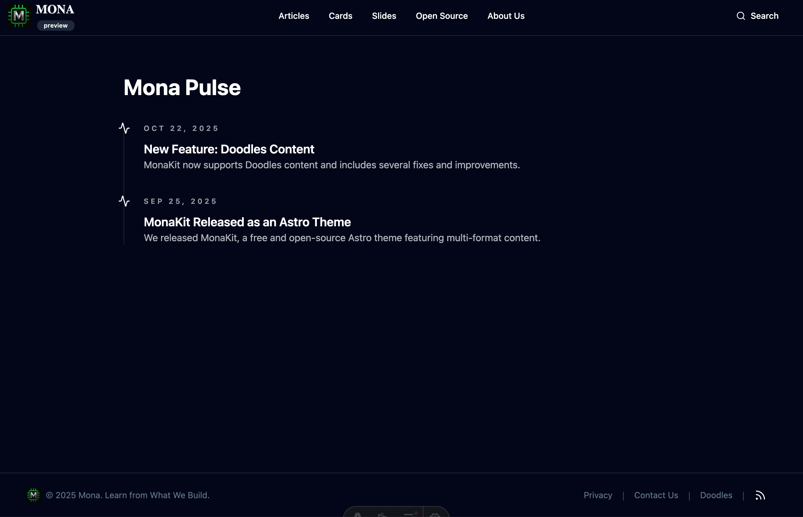

We support Doodles content in MonaKit, allowing users to easily create and manage Doodles on their Astro-powered sites. We design the doodle content type for any time-sensitive content, such as announcements, updates or events.

As with a blog or other content in MonaKit, a doodle is simply a Markdown file with its own metadata and saved in the `src/content/doodles` folder.

After a doodle is created, it is automatically rendered in the index page based on its date metadatas: `pubDate` and `endDate`.

Here is an example:

To see all the doodles created for a site powered by MonaKit, visit the `/doodles` page. The example below shows [the doodles](https://mymona.xyz/doodles) page on mymona.xyz:

In addition to this feature, we also fixed several bugs and made improvements, check out the [GitHub Commit History](https://github.com/DTeam-Top/mymona.xyz/commits/main/) to know more, loool.
